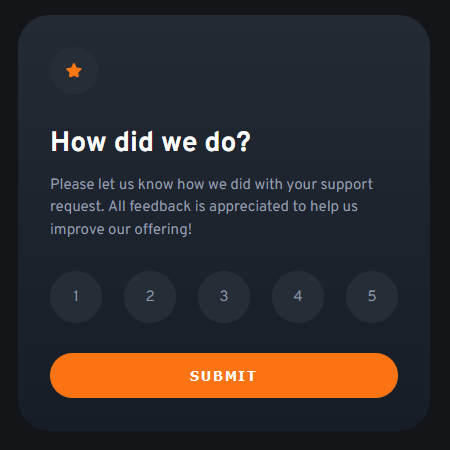
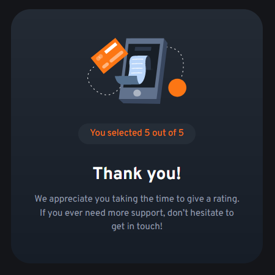

# Frontend Mentor - Interactive rating component solution

This is a solution to the [Interactive rating component challenge on Frontend Mentor](https://www.frontendmentor.io/challenges/interactive-rating-component-koxpeBUmI). Frontend Mentor challenges help you improve your coding skills by building realistic projects.

This project features an interactive component made using **CSS Grid and Flexbox**, with state changes via **JavaScript DOM manipulation**, and nice transitions between states made with **CSS animations**.

## Overview

### The challenge

Users should be able to:

- View the optimal layout for the app depending on their device's screen size
- See hover states for all interactive elements on the page
- Select and submit a number rating
- See the "Thank you" card state after submitting a rating

### Links

- [Solution on Frontend Mentor]()
- [Live Site on GitHub Pages]()

### Screenshots

|                            _Survey_ state                             |     |                              _Thank you_ state                              |     |                                   Demonstration                                    |
| :-------------------------------------------------------------------: | :-: | :-------------------------------------------------------------------------: | :-: | :--------------------------------------------------------------------------------: |
|  |     |  |     |  |

## My process

### What I learned

In this project, I have practiced the following skills:

- Using **JavaScript** for **client-side form validation** and **DOM manipulation**
- Using **modern JavaScript** features, such as optional chaining (`?.`)
- **Accessibility**: directing screen reader focus after a state change
- **Accessibility**: using the `aria-live` attribute and the `prefers-reduced-motion` media query
- Using **Grid**, **Flexbox** and **media queries**
- Creating **CSS animations**
- Working with **CSS Masking**
- Using **CSS relative units** to ensure the page scales according to the user's font size settings
- Using **CSS custom properties** to allow easy customization and reusability of components
- Using **Git** and **GitHub**

---

#### DOM manipulation: changing content without leaving the page

The rating component has two states, both of which are `
`s inside the `<main>` element: _survey_, containing the survey form, and _thank you_, containing a thank you message and the selected value. When the form is submitted, JavaScript is used to perform form validation and DOM manipulation, changing the document to:

- Show an error message if no value was selected
- Play CSS animations
- Hide the _survey_ state
- Set the confirmation message: _You selected X out of 5_
- Display the _thank you_ state

#### Accessibility: directing screen reader focus

Part of my process in every Frontend Mentor challenge is testing my solutions with screen readers. In this one, the state change presented an issue: after clicking "submit", screen readers would not start reading the newly displayed content of the _thank you_ state. To fix that, the `focus()` method was used inside the `displayThanks` function to direct focus to the top element of the _thank you_ state after displaying it: `ratingEl.focus();`.

Two other accessibility aspects that were implemented in this project are the following:

- Using `aria-live="polite"` to ensure the error message is announced by screen readers when the form is submitted with no value selected.
- Using the `prefers-reduced-motion` media query to disable all animations and transitions if the user prefers reduced motion.

### Continued development

To further develop this project, I would like to learn how to send the collected data to a back end using JavaScript, without leaving the page, and also about creating the back end itself to receive, process and store the data. Besides that, I really enjoyed creating the CSS animations in this project, and I want to keep learning how to use them to create interesting interfaces and experiences.

### Useful resources

- [_Pure CSS Custom Styled Radio Buttons_ (Stephanie Eckles)](https://moderncss.dev/pure-css-custom-styled-radio-buttons/) - A great article about styling radio buttons. It was very useful in this project.
- [_Managing focus for accessibility_ (Rob Dodson)](https://dev.to/robdodson/managing-focus-64l) - This article and its video were helpful when I needed to direct screen reader focus after changing states in the component.
- [_Optional chaining '?.'_ (The Modern JavaScript Tutorial)](https://javascript.info/optional-chaining) - This article helped me refactor part of my JavaScript code using optional chaining. It's very well written, and I'll definitely use the website as a reference again in future projects.
- [_CSS Masking_ (W3Schools)](https://www.w3schools.com/css/css3_masking.asp) - This reference helped me understand how to use a circular CSS Mask while creating the "close" animation.

## Author

- Frontend Mentor - [@JulioCinquina](https://www.frontendmentor.io/profile/JulioCinquina)
